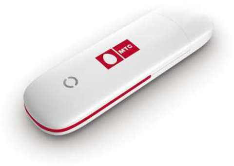
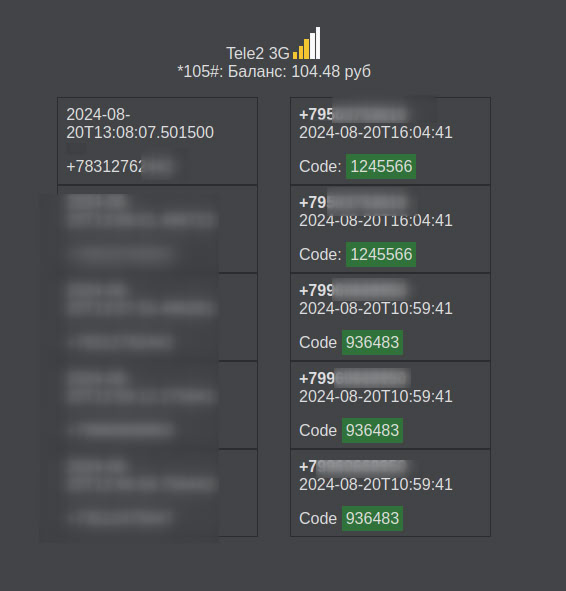
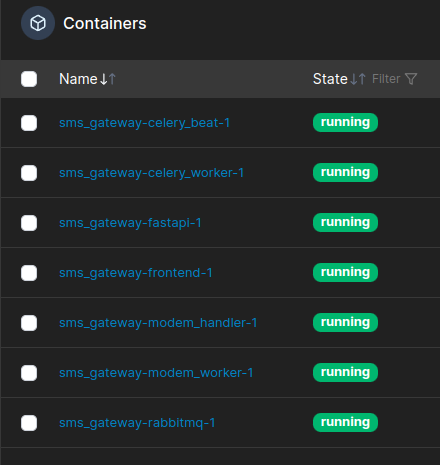

# Домашний СМС-шлюз

## Зачем?
 Получать и отправлять СМС не используя сторонние сервисы.
 Похожий проект: [Gammu and Wammu](https://wammu.eu/).
## Возможные кейсы.
- Использование в домашней автоматизации:
    * Отправить уведомление пользователю через СМС, например, что интернет недоступен
    * Считать команду из СМС, например, что-то сделать если интернет недоступен
    * Отправка показаний счетчика через СМС (у меня в ТСЖ это актуально)
- Использования для автоматизации входа в системы, где используется 2х-факторная авторизация

## Основные требования.
- Получить запись о звонке или СМС через API
- Отправлять сообщения через API

## Реализация

### Основные моменты.
За управляемое устройство был взят модем ZTE mf180 (валялся без дела много лет). Можно и другие модемы с поддержкой UART, но вероятно потребуются доработки.
Управляется устройство через UART с использованием AT команд. От модема к модему список AT команд может отличаться. Вот парочка общих ссылок с описанием команд: [3ginfo](https://3ginfo.ru/page54.html), [alex-exe.ru](https://alex-exe.ru/radio/wireless/gsm-sim900-at-command/). Так же модем нуждается в первичной настройке: разблокировка(для работы с любым оператором), отключение всяких сервисных режимов и дисководов, настройка автоматического поиска сети и т.д., все это делается так же с помощью AT команд.




### Схема работы:
Общими словами схему работы можно объяснить так:
1. Воркер общается с модемом посредством UART и AT команд. В воркер команды поступают из очереди RabbitMQ. В другую очередь складываются ответы этих команд.
2. Обработчик ответов модема слушает очередь, декодирует и всячески обрабатывает ответы. Складывает обработанные ответы в Postgres.
3. API ходит в postgres и отдает ответы по запросу и фильтрам.
4. Так же для постоянного опроса модема исользуется Celery. Он параллельно всему флоу публикует команды для модема, такие как: читать СМС, состояние сети и прочие.


### API

Получить СМС можно с помощью

``` bash
curl --location --request GET 'http://{host}/get-sms?dttm=2024-08-15 12:46:13&limit=10'
```
В качестве фильтров можно выставить
```
sender - телефон или имя отправителя
dttm - время с которого смотреть
limit - количество выводимых соообщений
```
Пример ответа
``` json
[
    {
        "id": 8459,
        "message_id": 0,
        "message_receive_dttm": "2024-08-20T16:04:41",
        "sender": "+795******",
        "text": "Code: 1245566"
    }
]
```
Получить звонки можно с помощью:
``` bash
curl --location --request GET 'http://{host}/get-calls?dttm=2024-08-15 12:46:13&limit=10'
```
В качестве фильтров можно выставить
```
dttm - время с которого смотреть
limit - количество выводимых звонков
```
``` json
[
    {
        "caller": "+7831*****",
        "created_at": "2024-08-20T13:08:07.501500"
    }
]
```


case:
1. Вы выполнили запрос на авторизацию и теперь вас просят ввести последние 6 цифр из входящего номера телефона.
2. Теперь вам должен поступить входящий звонок. 
3. Ставите регулярный опрос API со звонками и с временной отметкой начала авторизации.
4. Получаете ответ и обрабатываете номер телефона.

### Web-морда

Так же для наглядности работы системы был собран небольшой фронтенд с выводом основной информации об операторе, балансе и входящих смс и звонках. Отедльного API для него нет.



### Deployment

Запускается вся система в docker, с использованием docker compose. 
В системе запускаются следующие сервисы:
1. Rabbitmq - очередь.
2. modem_worker - контейнер, в который пробрасывается порт модема.
3. modem_handler - контейнер, обрабатывающий ответы от модема.
4. celery_beat - публикует задания на опрос модема.
5. celery_worker - публикует задания в очередь модема.
6. fastapi - api
7. frontend - web-морда

